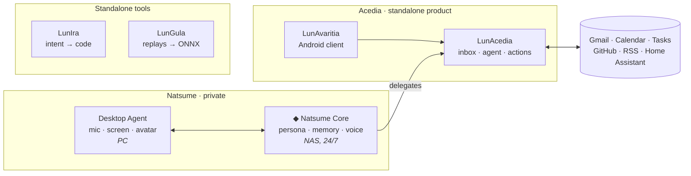

<div align="center">


<br/>

[](https://git.io/typing-svg)

[](https://crolix-website.vercel.app)
[](#-the-lun-ecosystem)

</div>

---

## ⟁ about

```typescript
const crolix = {
  alias    : "CrOliX-AltF4",
  location : "your WI-FI",
  focus    : ["Full-Stack Dev", "AI Integration", "Cognitive Systems"],
  currently: "Building a personal assistant",
  motto    : "Don't trust any lalafell" // - "a good friend"
} satisfies Developer;
```

Full-stack developer by training. On the side, I build **Lun'**: a set of standalone projects orbiting one
entity, **Natsume Tsurugi**, a personal assistant with a character that runs 24/7 on my home server.

---

## ◈ the lun' ecosystem

<div align="center">

```
  ┌─────────────────────────────────────────────────────────────┐
  │  "Born from scattered  memories.                            │
  │   Awakened to unite them."                                  │
  │                                         — Natsume Tsurugi   │
  └─────────────────────────────────────────────────────────────┘
```

</div>



| Project | What it is | Stack | Status |
|---|---|---|---|
| **LunAnima** · _private_ | Natsume's Core: persona, memory, emotion and voice. Links the satellites together | TypeScript · Node · Vue |  |
| [`LunAcedia`](https://github.com/CrOliX-AltF4/LunAcedia) | Information server: connectors, an inbox synced with its sources, an agent bound by autonomy tiers | TypeScript · Node · Docker |  |
| [`LunAvaritia`](https://github.com/CrOliX-AltF4/LunAvaritia) | Android client for LunAcedia: feed, chat, push notifications | Flutter · Dart · FCM |  |
| [`LunIra`](https://github.com/CrOliX-AltF4/LunIra) | Multi-agent dev pipeline CLI: PO → Planner → Dev → QA | TypeScript · CLI |  |
| [`LunGula`](https://github.com/CrOliX-AltF4/LunGula) | Imitation learning: game replays in, ONNX policy out | Python · PyTorch · ONNX |  |

**How it holds together**

- **Standalone first.** Every satellite works on its own. Turn Natsume off and nothing else breaks.
- **One LLM per project.** LunAcedia's agent handles mail and calendar. The Core routes the request, relays the answer and speaks it.
- **Hub-and-spoke.** Once wired, satellites only talk to the Core, never to each other.
- **Human in control.** Any AI can be switched off, paused or triggered by hand. Actions go through autonomy tiers (`auto` · `confirm` · `manual`).
- **Private by default.** Nothing is exposed to the internet. The phone reaches home over a private network.

---

## ◈ natsume, the core

> [!WARNING]
> **LunAnima** is proprietary software. Its source code is not open source, and all visual assets¹ used on the showcase site are © CrOliX-AltF4, All Rights Reserved. Do not redistribute or reuse them without permission.
>
> ¹ : in accordance with the artist's terms of use

A personal assistant with a character. More than a chatbot. She keeps track of my mail, calendar and
tasks, remembers what matters, speaks up when it's worth it and keeps me company while I play or work.

| Area | What she does |
|---|---|
| **Voice** | Groq Whisper STT, VAD, wake word, barge-in. TTS via Edge, Kokoro, Piper or ElevenLabs, plus an RVC voice changer |
| **Memory** | Short-term buffer, long-term facts, opinions and world model. Single write gate, daily consolidation, contradiction checks |
| **Personality** | 7 moods with natural decay, affinity tiers, controlled disagreement |
| **Assistant** | Hands mail, calendar and tasks over to LunAcedia's agent. Morning and evening briefs |
| **Presence** | Screen vision, game hooks (FF14, Minecraft, osu!), VTube Studio lip-sync |
| **Control** | Admin panel: every module can be switched off, paused or run by hand |

```
  PC · Desktop Agent                     NAS · Core (24/7)
  mic · STT · screen · avatar  ──ws──►   state · memory · LLM · panel  ──►  LunAcedia
                               ◄──────   reply + voice
```

---

## ◈ now building

| | |
|---|---|
| **Focus** | The assistant first: memory, inbox, delegation, response latency |
| **Next** | Live test on the NAS → scoped mobile keys → per-entity memory → mobile assistant |
| **Paused** | Streaming and LunGula, which will return together |
| **Mode** | YOLO, as always |

> [!TIP]
> The story behind the ecosystem, and the entity at its heart, lives on [my website](https://crolix-website.vercel.app).

---

## ⬡ stack

<div align="center">

| | |
|:---:|:---|
| **frontend** |          |
| **backend** |         |
| **mobile** |    |
| **AI** |      |
| **tooling** |      |

</div>

---

## ◈ github stats

<div align="center">


<br/>

[](https://git.io/streak-stats)

</div>

---

<div align="center">

```
  ╔══════════════════════════════════════════════════════════════╗
  ║          [ session terminated — memory persists ]            ║
  ╚══════════════════════════════════════════════════════════════╝
```

`natsume@w-AI-fu:~$ _`

</div>
